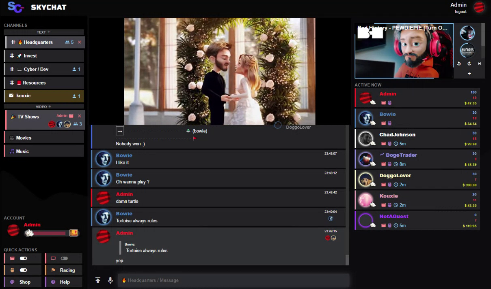

<p align="center">
    
</p>

<p align="center"><a href="#overview">Overview</a> → <a href="#how-to-install">Install</a> → <a href="#customize">Customize</a> → <a href="#contribute">Contribute</a></p>
<p align="right">Like this project? Please give a star ⭐</p>
    
</p>

## Overview

The SkyChat:
- 📺 Can play medias in a shared synchronized player. Medias can be self-hosted, from Youtube or Twitch
- 📁 Allows to organize uploaded medias into folders and tag them
- 📆 Lets you schedule medias to play at specific datetimes
- ⚽ Provides entertaining features: Live cursor visualization, Casino roulette, cursor-based football, ..
- 🔒 Provides privacy and security: Admin double auth, log fuzzing, shadow ban, TOR detector, ..
- 💻 Is trivial to install & configure


When multichannel is enabled, here is what it looks like:



### Synchronized media player

Users can play Youtube, Twitch and self-hosted videos in a shared synchronized players.

The player has two modes:
- A 'free' mode, selected by default, where any user can add a media. Orchestration is implemented through a public queue of videos to play, and decision-making (for instance to skip videos) is done with polls.
- A 'schedule' mode, when users with privilege schedule a media to play at a specific time. These medias can not be skipped, and users can view the schedule to see what medias will play in the upcoming days. When the scheduled media finishes, the player goes back in 'free' mode.


### Live cursor visualization and mini-games

Users can interact and play with integrated mini-games (which can be disabled in the configuration).
Users can also see each other cursors moving in real time. This gives a sense of proximity between users. This is the most iconic feature of the SkyChat.


### Cinema mode

If watching long videos, documentaries, or tv shows, the cinema-mode allows users to watch the video in full-screen and have the tchat minimized on the bottom-right of the screen.


### And much more

This is not all, but to discover all features, you may as well launch an instance and try it yourself!

## How to install

### Install in 30 seconds

If using docker you need:
- docker
- docker-compose

If not using docker, ensure you have the following installed on your system:
- nodejs >= 10
- sqlite3, zip, ffmpeg (e.g. `apt install -y sqlite3 zip ffmpeg`)

Then, follow these 2 steps:

```bash
# 1. Use the autoinstall script (Clones the repository then executes scripts/setup.sh)
bash <(wget -q https://raw.githubusercontent.com/skychatorg/skychat/master/scripts/autoinstall.sh -O -) && cd skychat

# 2.A. Run the app in docker
bash scripts/docker-start.sh
# 2.B. Run the app on your local host
npm i && npm start
```


### Application setup

By default, the application will be listening to `localhost:8080` and assume it is accessed from `http://localhost:8080`. In order to customize the domain name of your SkyChat application, edit the `.env.json` file. The fields in the .env.json contain the private variables of the application, listed below:


| field | type | default | semantic |
|-------|------|---------|----------|
| location                 | string | "http://localhost:8080" | Server location, i.e. what user need to put in their browser to access your app |
| hostname                 | string | "localhost" | Hostname the server will listen to |
| port                     | number | 8080 | Server port |
| ssl                      | false or {certificate:string,key:string}  | false | SSL configuration (paths to certificate and key files). Use false if SSL is disabled. |
| users_passwords_salt | string | "$RANDOM_SALT" | Password salt. |
| users_token_salt     | string | "$RANDOM_SALT" | Token salt. |
| youtube_api_key      | string | "" | [Youtube api key](#setup-youtube) |
| google_analytics_id  | string | "" | [Optional google analytics ID](https://analytics.google.com/analytics/web) |
| op                       | string[] | [] | OP usernames. OP usernames can use the /setright command. |
| op_passcode              | string? | "$RANDOM_PASSCODE" | OP passcode. Activate your OP session with `/op $op_passcode` |
| email_transport          | nodemailer.JSONTransport | {"sendmail": true,"newline": "unix","path": "/usr/sbin/sendmail"} | Value given to [nodemailer.createTransport](https://nodemailer.com/about/) to initialize the mailer |


### Setup Youtube

The SkyChat requires a key for the Youtube plugin to work. This key needs to be put in your `.env.json` file.

Using the Youtube API is free but there is a daily quota, which when exceeded blocks the requests until the next day. If it happens, the Youtube plugin will be disabled until the next day. 

1. Go to [the Google Cloud Platform](https://console.cloud.google.com/apis/api/youtube.googleapis.com/credentials). If you never activated the account, you will have to activate it. 
2. Click `Create credentials > API key`
3. Copy the generated API key, and paste it in your `.env.json` file (the variable name is `youtube_api_key`)
4. Restart the server

## Customize


### Customize preferences

The `config/preferences.json` file specifies application preferences. The available fields are detailed below.


| field | type | default | description |
|-------|------|---------|-------------|
| minRightForPrivateMessages      | number |  -1 | Min. right to send private messages |
| minRightForMessageHistory       | number |  -1 | Min. right to access room message history |
| minRightForAudioRecording       | number |  -1 | Min. right to share and play audio recordings |
| minRightForConnectedList        | number |  -1 | Min. right to access the list of currently active users |
| minRightForPolls                | number |  -1 | Min. right to create polls |
| minRightForGalleryRead          | number \| 'op' |  0 | Min. right to access the gallery |
| minRightForGalleryWrite         | number \| 'op' |  'op' | Min. right to add and remove gallery documents |
| minRightForPlayerAddMedia       | number \| 'op' |  0 | Min. right to add medias to the player |
| minRightForPlayerManageSchedule | number \| 'op' |  'op' | Min. right to manage the player schedules |
| maxReplacedImagesPerMessage     | number |  50 | Max. number of replaced images per message |
| maxReplacedStickersPerMessage   | number |  50 | Max. number of replaced stickers per message |
| maxNewlinesPerMessage           | number |  20 | Max. number of newlines per message |


### Customize plugins

The `config/plugins.txt` contains the list of enabled plugins.
To add a custom plugin, create a plugin object in `app/server/skychat/plugins/user_defined/` then add its name to `config/plugins.txt`.


### Customize ranks

`config/ranks.json` contains the rank definition (xp threshold and rank icon paths). Must be sorted by descending limit. The fields for each rank are:
  - limit: XP limit to have this rank. The last rank definition must have `0` as the limit, otherwise new users will not have any rank.
  - images: Image path corresponding to the rank icon for each 18 and 26px sizes. Image paths should be relative to `/assets/images/`.


### Customize the fake message history

`config/fakemessages.txt` contains the fake messages shown to users whose right level is less than `minRightForMessageHistory` defined in `preferences.json`. If `minRightForMessageHistory` is set to -1, you do not need to modify the fake messages since not one will see them.


### Customize guest names

`config/guestnames.txt` is the pool of non-logged usernames.
When a guest logs in, a random name is associated to its session. These names are randomly used from this file. If you want to change these names, keep in mind that they should not contain whitespace characters (anything matched by \s so newline, tab, space, ..). Default random names are animal names.


## Contribute

### Develop

To watch, build and run a local SkyChat server, use:

```bash
npm run dev
```

This will start a static file server & websocket server, available under the location specified in the `.env.json` file.
When the source files change, the build processes re-runs automatically.

### Add features

Please use only one of the following to suggest new features (or bug fixes):
- Create a pull request
- Open an issue with your proposal 
