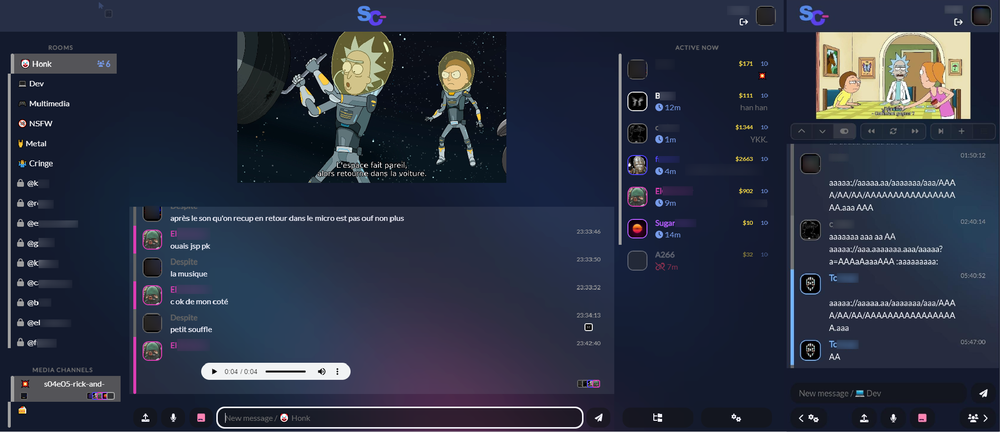

<p align="center">
    <br>
    Future-proof virtual cinema platform
</p>

<hr>

<p align="center"><a href="#overview">Overview</a> → <a href="#how-to-install">Install</a> → <a href="#customize">Customize</a> → <a href="#contribute">Contribute</a></p>
<p align="right">Like this project? Please give a star ⭐</p>
    
</p>

## Overview

The SkyChat lets you:
- 📺 Play medias in a shared synchronized player (Youtube, Twitch, self-hosted)
- 📁 Organize self-hosted medias in folders to easily search & play them.
- ⚽ Have fun with live cursor visualization, casino roulette, cursor-based football, etc..
- 🔒 Feel safe. OP double auth, log fuzzing, shadow ban, TOR network detection/ban, etc..
- 💻 Install and set it up in 2 minutes.



## How to install

### Install in 30 seconds

If using docker you need only docker. Otherwise, ensure you have the following installed on your system:
- nodejs >= 14
- sqlite3, zip, ffmpeg (e.g. `apt install -y sqlite3 zip ffmpeg`)

Then, follow these 2 steps:

```bash
# 1. Use the autoinstall script (Clones the repository then executes app/script/setup.sh)
bash <(wget -q https://raw.githubusercontent.com/skychatorg/skychat/master/app/script/autoinstall.sh -O -) && cd skychat

# 2.A. Run the app in docker
docker compose up
# 2.B. Run the app on your local host
npm i && npm start
```

### Application setup

By default, the application will be listening to `localhost:8080` and assume it is accessed from `http://localhost:8080`. In order to customize the domain name of your SkyChat application, edit the `.env.json` file. The fields in the .env.json contain the private variables of the application, listed below:


| field | type | default | semantic |
|-------|------|---------|----------|
| location                 | string | "http://localhost:8080" | Server location, i.e. what user need to put in their browser to access your app |
| hostname                 | string | "localhost" | Hostname the server will listen to |
| port                     | number | 8080 | Server port. If you are using docker only, modify DOCKER_PORT to match this value. |
| ssl                      | false or {certificate:string,key:string}  | false | SSL configuration (paths to certificate and key files). Use false if SSL is disabled. |
| plugins              | string[] | [] | List of enabled plugin groups. It is possible to disable the player, games, the gallery or other features by removing a plugin group from this list |
| users_passwords_salt | string | "$RANDOM_SALT" | Password salt. |
| users_token_salt     | string | "$RANDOM_SALT" | Token salt. |
| youtube_api_key      | string | "" | [Youtube api key](#setup-youtube) |
| google_analytics_id  | string | "" | [Optional google analytics ID](https://analytics.google.com/analytics/web) |
| op                       | string[] | [] | OP usernames. OP usernames can use the /setright command. |
| op_passcode              | string? | "$RANDOM_PASSCODE" | OP passcode. Activate your OP session with `/op $op_passcode` |
| email_transport          | nodemailer.JSONTransport | {"sendmail": true,"newline": "unix","path": "/usr/sbin/sendmail"} | Value given to [nodemailer.createTransport](https://nodemailer.com/about/) to initialize the mailer |


### Setup Youtube

The SkyChat requires a key for the Youtube plugin to work. This key needs to be put in your `.env.json` file.

Using the Youtube API is free but there is a daily quota, which when exceeded blocks the requests until the next day. If it happens, the Youtube plugin will be disabled until the next day. 

1. Go to [the Google Cloud Platform](https://console.cloud.google.com/apis/api/youtube.googleapis.com/credentials). If you never activated the account, you will have to activate it. 
2. Click `Create credentials > API key`
3. Copy the generated API key, and paste it in your `.env.json` file (the variable name is `youtube_api_key`)
4. Restart the server

## Customize


### Disabling features

Plugins are grouped in so-called `PluginGroup` instances. It is possible to disable specific features of the application by removing the plugin group name from the `env.json` file. By default, these plugin groups are included:

| name | removable | description |
|---------------------------|-----------|------------------------------------------------|
| CorePluginGroup           | ❌         | Basic features for the SkyChat to run properly |
| PlayerPluginGroup         | ✅         | Shared player functionnality |
| GamesPluginGroup          | ✅         | All the fun features, live cursor visualization and mini games |
| ExtraSecurityPluginGroup  | ✅         | Log fuzzer, TOR auto-ban, IP history tracker, user usurp command |
| GalleryPluginGroup        | ✅         | Gallery for self-hosted medias |
| UserDefinedPluginGroup    | ✅         | Custom plugins. By default, this plugin group contains no plugin, but any user-created plugin will be held by this instance |

In private rooms, only core plugins are loaded.


### Customize preferences

The `config/preferences.json` file specifies application preferences. The available fields are detailed below.

| field | type | default | description |
|-------|------|---------|-------------|
| minRightForPrivateMessages            | number |  -1 | Min. right to send private messages |
| minRightForShortTermMessageHistory    | number |  -1 | Min. right to access short term room message history |
| minRightForMessageHistory             | number |  -1 | Min. right to access full room message history |
| minRightForUserModeration             | number | 'op' | Min. right to ban, kick and access user ips |
| minRightForSetRight                   | number | 'op' | Min. right to set user right |
| minRightForAudioRecording             | number |  -1 | Min. right to share and play audio recordings |
| minRightForConnectedList              | number |  -1 | Min. right to access the list of currently active users |
| minRightForPolls                      | number |  -1 | Min. right to create polls |
| minRightForGalleryRead                | number \| 'op' |  0 | Min. right to access the gallery |
| minRightForGalleryWrite               | number \| 'op' |  'op' | Min. right to add and remove gallery documents |
| minRightForPlayerAddMedia             | number \| 'op' |  0 | Min. right to add medias to the player |
| minRightForPlayerManageSchedule       | number \| 'op' |  'op' | Min. right to manage the player schedules |
| maxReplacedImagesPerMessage           | number |  50 | Max. number of replaced images per message |
| maxReplacedStickersPerMessage         | number |  50 | Max. number of replaced stickers per message |
| maxReplacedRisiBankStickersPerMessage | number |  50 | Max. number of replaced RisiBank stickers per message |
| maxNewlinesPerMessage                 | number |  20 | Max. number of newlines per message |
| maxConsecutiveMessages                | number |  1  | Max. number of consecutive messages in a room |
| maxMessageMergeDelayMin               | number |  10 | Max. minutes before not merging consecutive messages |
| daysBeforeMessageFuzz                 | number |  7  | Number of days before messages are fuzzed, if ExtraSecurityPluginGroup is enabled |
| invertedBlacklist                     | boolean |  false  | Whether blacklisted users can not see messages from users who blacklisted them |
| messagesCooldown                      | ([number, number])[] | [ [ -1, 0] ] | Minimum duration between two consecutive messages for each right level, sorted by ascending right number |

### Customize the fake message history

`config/fakemessages.txt` contains the fake messages shown to users whose right level is less than `minRightForShortTermMessageHistory` defined in `preferences.json`. If `minRightForShortTermMessageHistory` is set to -1, you do not need to modify the fake messages since not one will see them.

`minRightForMessageHistory` defines who can quote old messages and navigate room old history.


### Customize guest names

`config/guestnames.txt` is the pool of non-logged usernames.
When a guest logs in, a random name is associated to its session. These names are randomly used from this file. If you want to change these names, keep in mind that they should not contain whitespace characters (anything matched by \s so newline, tab, space, ..). Default random names are animal names.

### Adding features

The SkyChat is easily extensible through plugins. You can define custom plugins in `app/server/skychat/plugins/user_defined/`. It will be automatically loaded during the next application startup.


## Contribute

### Develop

To watch, build and run a local SkyChat server, use:

```bash
npm run dev:server
# If you are also working on the client, type in an another bash:
npm run dev:client
```

This will start a static file server & websocket server, available under the location specified in the `.env.json` file.
When the source files change, the build processes re-runs automatically.

### Add features

Please use only one of the following to suggest new features (or bug fixes):
- Create a pull request
- Open an issue with your proposal 
